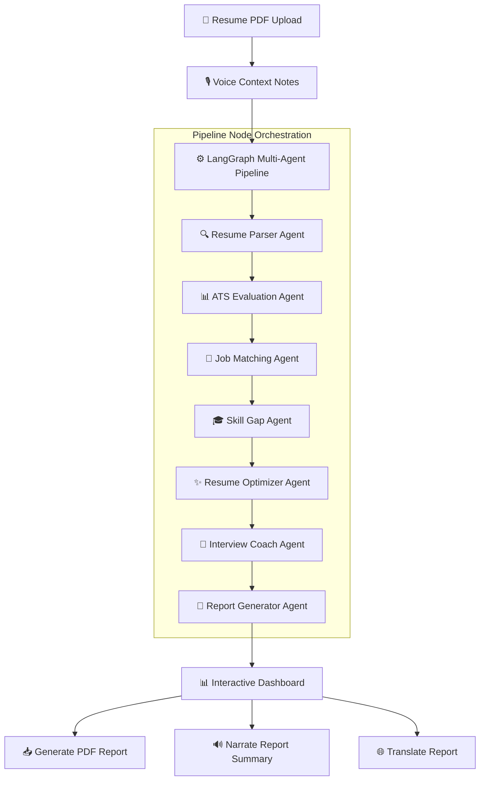

# 🧠 HireReady AI — Multi-Agent Resume Intelligence & Career Coach

<p align="center">
  
  
  
  
</p>

---

**HireReady AI** is a premium, commercial-grade resume intelligence platform powered by a **multi-agent LangGraph architecture** and a modern **Glassmorphic design system**. The platform parses resumes, evaluates ATS score compliance, performs semantic job role matching, discovers skill gaps, generates optimized bullet-points, and builds custom interview coaching tools—supporting both voice notes (Speech-to-Text) and audio narration (Text-to-Speech) out of the box.

https://hirereadyai-n6vh47cfgeevrsdkcusztx.streamlit.app/
---

## 📸 Premium UI Interface

The user interface has been completely redesigned using a modern **SaaS design system**:
* **Glassmorphic Visuals**: Dark Navy layout (`#090D1A`) with glass cards, glows, and subtle hover animations.
* **SVG Metric Rings**: 5 interactive dashboard metrics (ATS Score, Job Match, Resume Quality, Interview Readiness, and Overall Career Rating).
* **Live Step-by-Step Pipeline**: Real-time loader streaming node transitions via `workflow.stream()`.
* **7-Tab Workspace**: Highly organized dashboard showcasing deep candidate analytics, vertical timelines, before/after optimizer grids, and customizable difficulty filters.

---

## ⚙️ Core Architecture



---

## 🚀 Key Features

* **🔍 Multi-Agent Orchestration**: Six distinct agents cooperate sequentially inside a LangGraph StateGraph, passing candidate data and scoring updates through a unified state.
* **🤝 Semantic Job Match (FAISS)**: Blends three matching vectors—LLM qualitative review, key term density, and SentenceTransformers semantic embedding similarity.
* **🎙️ Voice Context Notes**: Record or upload audio notes detailing career preferences. Speech is transcribed in real-time and dynamically injected into the target goals input field.
* **✨ Split-Screen Optimizer**: Displays side-by-side (Before/After) bullet transformations, complete with clipboard copying widgets.
* **🔊 Audio Summary Narration**: Auto-synthesizes a high-fidelity audio review of your career assessment via ElevenLabs.
* **🌐 Multilingual Localization**: Instantly translates reports into Tamil, Hindi, Telugu, Kannada, or Malayalam using OpenRouter.

---

## 🛠️ Installation & Setup

### 1. Prerequisites
Ensure you have **Python 3.13+** installed.

### 2. Clone and Setup Environment
```bash
git clone https://github.com/your-username/HireReady_AI.git
cd HireReady_AI
```

Create a localized virtual environment and activate it:
```bash
python -m venv venv_new
# On Windows PowerShell:
venv_new\Scripts\Activate.ps1
# On macOS/Linux:
source venv_new/bin/activate
```

### 3. Install Dependencies
```bash
pip install -r requirements.txt
```

### 4. Configuration
Create a `.env` file in the root folder (or copy `.env.example`) and supply your API credentials:
```env
# OpenRouter LLM Access
OPENROUTER_API_KEY=your_openrouter_api_key
OPENROUTER_MODEL=openai/gpt-oss-20b

# ElevenLabs Voice STT/TTS
ELEVENLABS_API_KEY=your_elevenlabs_api_key
ELEVENLABS_VOICE_ID=21m00Tcm4TlvDq8ikWAM
```

---

## 💻 Running the Application

Launch the Streamlit dashboard:
```bash
streamlit run app.py
```
After the server initializes, visit **`http://localhost:8501`** in your web browser.

---

## 📂 Project Structure

```text
HireReady_AI/
├── app.py                     # Streamlit frontend & Custom CSS
├── main.py                    # LangGraph orchestration layer
├── config.py                  # Environment config loader
├── memory.py                  # JSON local memory persistence
├── requirements.txt           # Environment requirements
├── agents/                    # Specialized AI Agent Nodes
│   ├── resume_parser.py       # Entity extractor
│   ├── ats_agent.py           # Struct/format reviewer
│   ├── job_match_agent.py     # Competency matching
│   ├── skill_gap_agent.py     # Roadmap planner
│   ├── resume_optimizer.py    # Copywriting enhancer
│   ├── interview_agent.py     # Coaching simulation
│   └── report_generator.py    # Document builder
├── tools/                     # Core computational tools
│   ├── pdf_parser.py          # PyMuPDF text reader
│   ├── job_match.py           # FAISS embeddings matching
│   ├── keyword_extractor.py   # TF-IDF keyword overlap
│   ├── voice.py               # ElevenLabs TTS & STT client
│   ├── report_pdf.py          # ReportLab PDF generator
│   └── translator.py          # OpenRouter multi-language helper
└── prompts/                   # Structured system instructions
```

---

## 📄 License
This project is licensed under the MIT License - see the LICENSE file for details.

